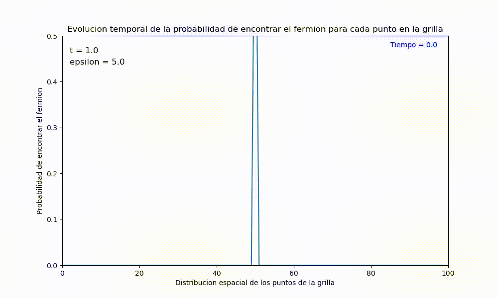

# Resultados 

En esta sección se mostrarán los resultados obtenidos de MODELO DE TIGHT BINDING DE OCUPACIÓN SIMPLE CON POTENCIAL DEFINIDO: DINÁMICA.    

#### Variación de los parámetros energéticos

