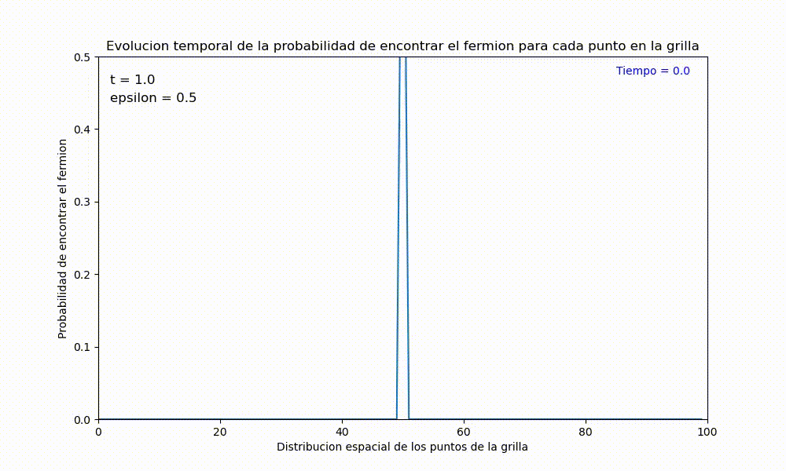
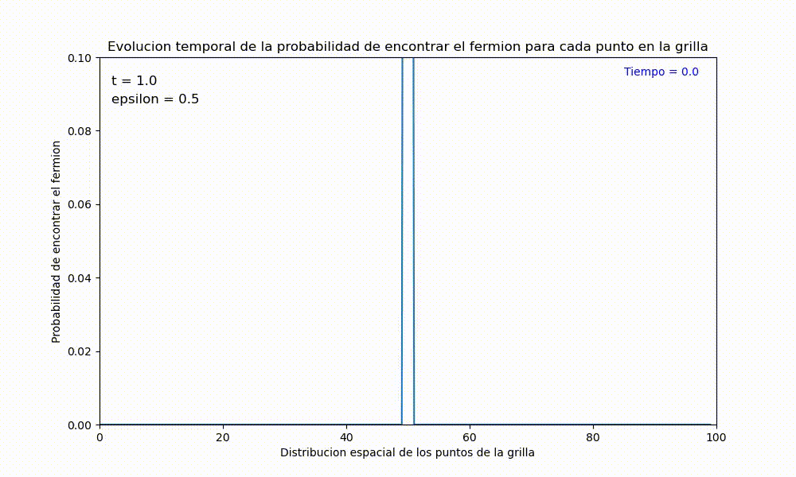
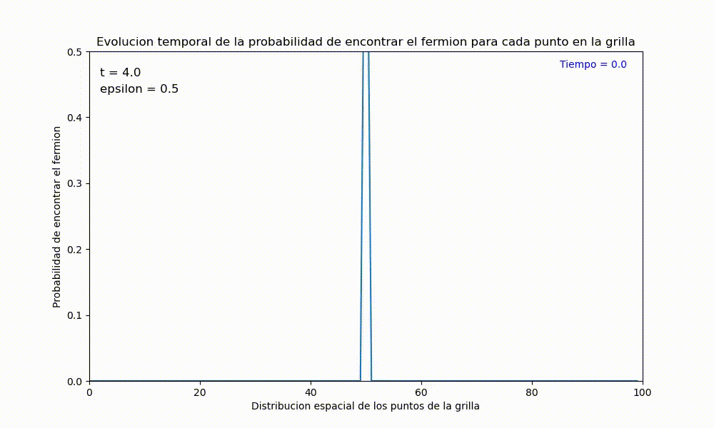

# Resultados 

En esta sección se mostrarán los resultados obtenidos de MODELO DE TIGHT BINDING DE OCUPACIÓN SIMPLE CON POTENCIAL DEFINIDO: DINÁMICA.    

En la siguientes gráficas se puede observar la probabilidad de encontrar un fermión en cada uno de los puntos de la grilla, dependiendo de la distribución espacial de dichos puntos, empezando con un estado inicial en el cual un fermión inicia en el medio de la grilla. Este gráficos se toman como referencia para poder observar los cambios que se dan al variar los parámetros energéticos $t_{i}$ y epsilon_{i} y así poder comprender que sucede al evolucionar de manera temporal la probabilidad de encontrar el fermión en cada punto de la grilla. Note que los valores iniciales se definen como $t_{i} = 1$, $epsilon_{i} = 0.5$, y $epsilom_{i} = 5$, en un tiempo de aprox de 25 segundos. 

### Variación de los parámetros energéticos

Al realizar un cambio en el valor de $epsilon_{i} = 5$, el cual se define como un potencial local, al aumentar dicho valor se observa como aumenta la energía local, desplazándose hacia los valores más altos. Esto afecta cómo se comporta la probabilidad de ocupación en el tiempo. Se puede observar un desplazamiento o redistribución en la probabilidad de ocupación a lo largo de la grilla, lo cual se refleja visualmente en que los picos que se obtienen son menos pronunciados. 

Ahora, al variar el parámetro $t_{i} = 4$, es decir, al aumentar su valor se incrementará la amplitud de hopping (medida de la probabilidad de que un electrón se transfiera, haga un salto, desde un sitio a otro). Esto conducirá a una mayor movilidad del fermión a través de la grilla, ya que los electrones tendrán más probabilidad de moverse rápidamente entre sitios cercanos y en términos de evolución temporal, se observa una difusión más rápida de la probabilidad de ocupación a través de la grilla.

Finalmente, en este últimoo gráfico se puede observar como se comporta la probabilidad de encontrar el fermión en cada punto de la grilla en un tiempo considerablemente largo, aproximadamente 30 minutos, pero se muestra un timelapse de la evolución de la grilla, transformado en 30 segundos. Esto para reflejar que la probabilidad tiende a distribuirse uniformemente. En otras palabras, el sistema puede alcanzar un equilibrio dinámico donde la probabilidad de ocupación en cada sitio de la grilla se estabiliza. Esto significa que la probabilidad de encontrar el fermión ya no cambia significativamente con el tiempo después de un período de transición inicial.

